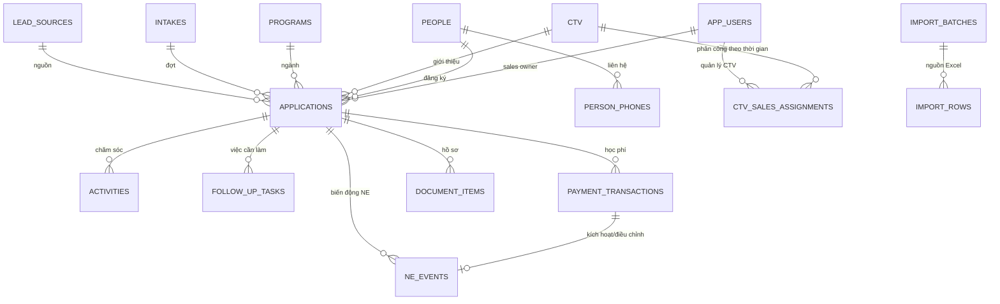

# Phase 1 — Thiết kế dữ liệu và quy tắc import (bản dự thảo)

## Mục tiêu

Chuyển các sheet đang cập nhật thủ công thành một nguồn dữ liệu có mã định danh, phân quyền và lịch sử. `schema.sql` là thiết kế PostgreSQL để review; chưa áp dụng vào hệ thống vì các quyết định nghiệp vụ còn mở trong đặc tả Phase 0.

## Sơ đồ dữ liệu lõi



Một `person` là một người liên hệ. Một người có thể có nhiều `application` nếu đăng ký chương trình/đợt khác nhau; điều kiện đếm nhiều NE cho một người vẫn cần được chủ nghiệp vụ duyệt. CTV được quản lý bằng ID và lịch sử phân công, không dùng tên tự do làm khóa.

### Quy tắc quyền truy cập

- Admin và Leader đọc tất cả theo yêu cầu hiện tại.
- Sales đọc `application` mình phụ trách. Với NE do CTV giới thiệu, sales đọc khi ID của mình trùng `ctv_manager_at_ne_id` đã ghi tại sự kiện NE. Khi CTV chuyển chủ, NE cũ giữ snapshot và không hiện cho sales mới.
- Lead chưa thành NE dùng sales owner hiện tại hoặc CTV owner hiện tại. Quyền sửa tách khỏi quyền đọc; mặc định dự thảo sales sửa hồ sơ mình là sales owner.
- Mọi endpoint chi tiết, tìm kiếm, dashboard, export và tải file dùng cùng một bộ lọc quyền ở backend. Với dữ liệu NE lịch sử, không tính lại quyền từ `ctv.current_owner_sales_id`.
- Khi hoàn tiền của một NE cũ, sự kiện điều chỉnh kế thừa `credited_sales_id` và `ctv_manager_at_ne_id` từ sự kiện công nhận NE gốc để quyền xem và KPI không chuyển sang chủ CTV mới.

### Quy tắc thanh toán và NE

1. Sales ghi một `payment_transactions` chờ xác nhận, có loại khoản, số tiền dương, `bank_at` và bằng chứng nếu có.
2. Người có quyền xác nhận kiểm tra; khoản `TUITION_RECEIPT` đầu tiên làm học phí ròng vượt 0 tạo `ne_events` `+1` với `event_at = bank_at`.
3. Các khoản đóng thêm không tạo thêm NE. Khi `TUITION_REFUND` làm học phí ròng về 0, tạo `ne_events` `-1` với ngày tiền hoàn. Trường hợp nộp lại sau hoàn tiền là quy tắc còn chờ duyệt.
4. Các bước xác nhận thanh toán và tạo sự kiện NE phải nằm trong cùng một giao dịch DB; `payment_transaction_id` là duy nhất trong bảng sự kiện để tránh cộng/trừ hai lần khi người dùng bấm lại.
5. Bảng tính KPI nên cộng `ne_events.delta`; hiển thị riêng NE mới và NE hoàn để người quản lý hiểu biến động. Giờ lưu UTC; ngày kinh doanh hiển thị theo múi giờ Asia/Bangkok.

## Quy trình import dữ liệu lịch sử

```text
Excel gốc (chỉ đọc)
  → nhận diện file/sheet/dòng
  → chuẩn hóa kiểu dữ liệu và điện thoại
  → đối chiếu danh mục ngành/đợt/nguồn/nhân sự/CTV
  → phát hiện trùng tiềm năng
  → preview + hàng chờ duyệt
  → commit theo batch
  → báo cáo tổng và log từng dòng
```

### Thứ tự xử lý

1. Khai báo nhân sự, ngành, đợt, nguồn và danh sách CTV đã xác nhận.
2. Import `NE 2026` như dữ liệu lịch sử ưu tiên. Dòng thiếu ngành/owner hoặc học phí không phải số được đưa vào hàng chờ; vẫn giữ số dòng gốc để đối chiếu.
3. Import `Data CTV`, `LEAD ONLINE`, `Lead tự tạo`, rồi `Zalo OA` và `Web gmail Viện`; đối chiếu với hồ sơ NE đã vào hệ thống trước khi tạo người mới.
4. Import `NE 2025`, `NE 2024` sau khi ánh xạ các cột khác bố cục và xác định phần nào đã xuất hiện ở sheet hỗ trợ/nháp.
5. Không import các sheet `SUMMARY`, bản nháp hoặc báo cáo KPI như hồ sơ khách hàng; dùng chúng để kiểm tra số và lưu bản gốc. Không tự tạo sự kiện thanh toán đã xác nhận từ cột “Học phí nộp”.

### Quy tắc chuẩn hóa và kiểm tra

| Trường | Chuẩn hóa/kiểm tra | Khi lỗi |
|---|---|---|
| Họ tên | Giữ nguyên bản gốc và thêm khóa so khớp bỏ dấu/chữ thường | Thiếu tên: review, không tự xóa dòng |
| Điện thoại | Chuỗi, bỏ dấu phân cách, đổi `84...` thành `0...`; giữ số gốc; chấp nhận nhiều số trong một ô | Không khớp số hợp lệ: review; không chuyển sang numeric |
| CCCD | Chuỗi, giữ số 0 đầu, không hiện trong file báo cáo audit | Sai định dạng: review; dữ liệu nhạy cảm được giới hạn quyền |
| Ngày | Chuyển Excel date hoặc `dd/mm/yyyy` thành ngày chuẩn; ghi giá trị gốc | Không đoán ngày mơ hồ; review |
| Tiền | Chuyển số VND, không dùng chuỗi có ghi chú làm thanh toán xác nhận | Text/0/trống: review |
| Ngành/đợt/nguồn | Ánh xạ bằng bảng danh mục đã duyệt | Giá trị lạ: review, không tự đổi sang giá trị gần nhất |
| Sales/CTV | Ánh xạ tên gốc sang mã bằng bảng đã duyệt, lưu cả giá trị gốc | Không ánh xạ được: review; không mở quyền sales theo chuỗi tự do |
| Trạng thái | Lưu nhãn gốc; ánh xạ theo từ điển đã duyệt | `NE` dạng text không tạo NE chính thức |

### Tính lặp lại và truy vết

`import_batches` lưu tên file và SHA-256 của nội dung; `import_rows` lưu sheet, dòng, trạng thái và bản ghi đích. Cùng một file/sheet/dòng không được tạo hồ sơ mới lần hai. Nếu người dùng sửa dữ liệu nguồn rồi import lại, hệ thống hiện diff và yêu cầu duyệt thay đổi. Không xóa bản ghi lịch sử bằng cách chạy lại import.

## Bộ audit chạy trong Phase 1

Chạy `python phase1/audit_workbooks.py` từ thư mục gốc (cần `openpyxl`). Script chỉ đọc hai workbook và xuất dữ liệu tổng hợp/ID dòng sang `phase1/reports`:

- `source_profile.json`: số dòng có tên, mức đầy đủ của trường, trạng thái, số KPI và chỉ số CTV.
- `review_queue.csv`: vấn đề cần xử lý theo sheet/dòng, không kèm họ tên hay điện thoại.
- `duplicate_candidates.csv`: nhóm cùng số điện thoại chuẩn hóa, chỉ hiện 4 số cuối và tọa độ nguồn; đây là ứng viên kiểm tra, không tự ghép.
- `kpi_reconciliation.csv`: từng tháng, mục tiêu, tổng cột M, tổng ô cá nhân H–L và công thức gốc.

Số điện thoại có thể được dùng chung trong gia đình, thay đổi theo thời gian hoặc nhập nhiều số trong một ô. Vì vậy cùng số điện thoại không đủ làm bằng chứng một người. Phải so sánh tên, CCCD/MSSV khi có quyền và lịch sử trước khi ghép.

Chạy `python phase1/prepare_mapping_review.py` để tạo bốn bảng duyệt riêng: `sales_roster_draft.csv` (5 tên từ KPI 2026), `sales_alias_review.csv` (26 chuỗi người xử lý từ các sheet NE/lead), `ctv_alias_review.csv` (42 chuỗi CTV trong Data CTV) và `ctv_roster_review.csv` (31 tên roster). Các bảng này **có tên nhân sự/CTV**, không có tên khách hàng, CCCD hay điện thoại. Với CTV, `suggested_sales_from_tele` là sales xuất hiện nhiều nhất ở các lead của CTV, kèm số dòng ủng hộ; đó có thể là người xử lý lead chứ không phải người quản lý CTV. `approved_user_id`/`approved_ctv_id` và quyết định vẫn để trống cho người phụ trách điền. Không nhập quyền hệ thống từ giá trị gợi ý chưa duyệt.

Sau hai bước trên, chạy `python phase1/dry_run_import.py`. Script đọc dữ liệu trong bộ nhớ, gợi ý nhóm người khi **tên chuẩn hóa và ít nhất một số điện thoại cùng khớp**, rồi xuất `import_preview.csv`, `lead_ne_link_candidates.csv` và `import_dry_run_summary.json`. Mỗi nguồn vẫn là một hồ sơ tuyển sinh/lead riêng; nhóm người và liên kết lead–NE chỉ là ứng viên, không tự ghép. Dòng `LEAD ONLINE` có liên kết Facebook vẫn được coi là có kênh liên hệ nếu thiếu số điện thoại. Với `NE 2025/2024`, owner chưa có cột nguồn rõ ràng nên luôn chờ ánh xạ lịch sử.

## Quyết định kỹ thuật còn cần trước migration thật

- Danh sách ID nhân sự và xác nhận 13 chuỗi tư vấn viên trong AB của `NE 2026` ánh xạ tới ai.
- Danh sách CTV thực tế: 42 chuỗi ở `Data CTV` so với 31 tên roster; cách xử lý tên viết tắt/người giới thiệu không phải CTV.
- Ai được xác nhận khoản thu; nguồn chứng từ ngân hàng; cách xử lý xác nhận muộn ở tháng đã khóa.
- Danh mục chương trình/đợt, quy tắc một người đăng ký nhiều chương trình, trạng thái chuẩn và quyền sửa sau NE.
- Chính sách giữ và bảo vệ CCCD, file hồ sơ, ghi chú nhạy cảm; môi trường deploy và backup.

